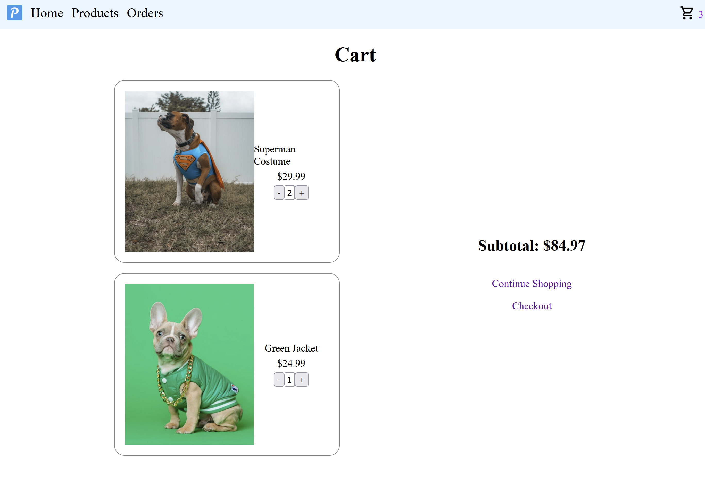
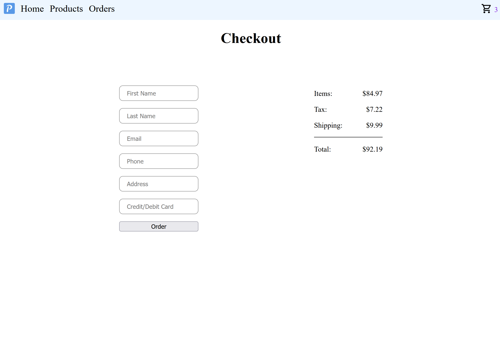

# Pet Clothing Store

[Live Demo](https://lkong01.github.io/shopping/)

An e-commerce website for pet lovers to shop clothing including shirts, hoodies, shoes, accessories, etc, for their pets.

It is implemented using React. Ebay API key is pending for approval and will be used to offer more product choices and a search feature.

## Current Features

- Add products to shopping cart
- Adjust number of selected items
- Calculate expenses including tax and fees
- Check out shopping cart
- Display orders

### Demo Images

##### Front Page

##### Products

##### Shopping Cart

##### Check-out

